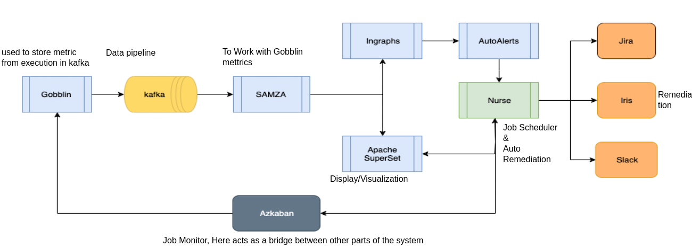

# Linkedln data pipeline monitoring system

## Data Properties

## Data pipline Properties

- pipeline: [Kafka](#kafka) ingestion

### 📀 Tech

`SLA`: service level agreement

#### `SAMZA`:

- About:
  Is a `distributed stream processing framework `, utilized to ingest Gobblin metrics
  can stream metrics from multiple Kafka topics and can be deployed on Hadoop YARN

#### `Kafka`: Ingest Data/ Create Pipeline

- About:
  Is core part of LinkedIn infrastructure.
  It is a `stream processing platform` developed by LinkedLn
- Kafka audit

#### `Hadoop`: Store/ Process data

#### `Azkaban`: Monitor jobs

#### `Gobblin`:

- About:
  `data ingestion framework`, Gobblin events are "fire_n_forget reports" of execution, emittes back to Kafka

#### `Nurse`:

- About:
  - event-driven automation platform for workflow execution, data gathering and data remediation
    developed by LinkedLn,
  - Connected to Azkaban and act as both hardoop scheduler & remediator

#### `Superset`:

- About: Superset is a web-based application for data visualizations

#### `Kyaraben`: Monitor Dashboard application

icons next to each job represented the status of the last five job runs: green representing success, red representing failure, and blue representing a running job in progress.

### 📏 Metrics

#### Data Ingestion Lag

number of source hours ingested within a given ingestion hour  
`source hour `is the full hour of the clock time when the data was produced.  
`ingestion hour` is the full hour when it was ingested into Hadoop. 
Each source hour can be ingested across multiple ingestion hours.

#### Data Loss

record counts available at the source for a given mapper task and HDFS auditing events that show total records written per mapper task.​

#### Data Availability

- Fast Method: 
  - Metrics: (time for stabalised msg count from both Producer - Kafka tiers) from Kafka rest API within 5min interval:
    - Percentage available in HDFS as compared to the Kafka tier
    - Late producers​
    - Late Kafka arrivals​
    - Time to update data into HDFS
  - Prop:
    - Use Kafka Audit -> rely on:
      - LinkedIn to publish counts of events
      - Samza that makes use of the “at least once” semantics
        --> counting the same record more than once, which causes the producer or Kafka tiers to show more records than actually produced
      - costly operations
      - timestamp used by Kafka audit and the timestamp used to group the source hour directory on HDFS are not the same (miliseconds difference)  --> small inaccuracies --> fine with SLA but not with others (mobile device sets the source timestamp)
- Slow Method: Consumption Test  
  - Metrics:
    - topic level lag metric
    - timestamp of the last file written into HDFS
    - data loss: there should be no mappers associated with the topic source hour in regards to data loss
  - Prop:
    slower due to the use of the lag metric

## 🔥 DEV Log

- Ver 1: non-realtime solution
   monitor \_pass_fail_status of jobs via [Azkaban](#azkaban) app called [Kyaraben](#kyaraben-monitor-dashboard-application)
  - this however can result in success job with stuck kafka topic, hence the problem can only be seen when end-user realise the data is unavailable
    --> lacked real-time monitoring and clarity in the resulting insights.
  * Why?
  - Hadoop Job brings Kafka's data to HDFS (Hadoop Distributed File System). mà Kafka topic were no longer moving forward thì cx đồng nghĩa ko có data để được feed/ nhận
  - 2 ways to understand:
    - Kafka topic chết -> job chết -> Kyaraben ra đỏ (phát hiện luôn được sai thì cần gì metrics nx)
    - Kafka topic chết -> job chết -> Kyaraben vẫn ra xanh thì cno mới ko biết có lỗi mà phải đợi đến khi có tk cần dùng data ở topic đấy ý kiến "data unavailable" ?
- Ver 2:

  - Realtime : Deal with Lag and the loss metrics & Avoid false alert. 
    - Job level: Realtime use multiple batch metric, and based on their relationship to determine whether the outcome is Error or Not.
    - Dataset level: aggregate the data from various metrics to understand 3 key metrics: [Data ingestion lag](#data-ingestion-lag) / [Data loss](#data-loss)/ [Data availability](#data-availability)
  - Improved monitor architecture:
    
  - Auto remediation:
    - Job error -> identify root cause by take thread dumps in timed intervals. + Wait to capture all logs, then restart job
    - problematic dataset arises in the job -> denylist/ignore it
    - in case all of dataset ingestion + Kafka audit count + upstream: override Azkaban job's parameter --> skip "false alert" + "taking corrective" action
    - Nurse --> identify problem --> with Superset based API --> appropriate action (eg: override Azkaban job)
